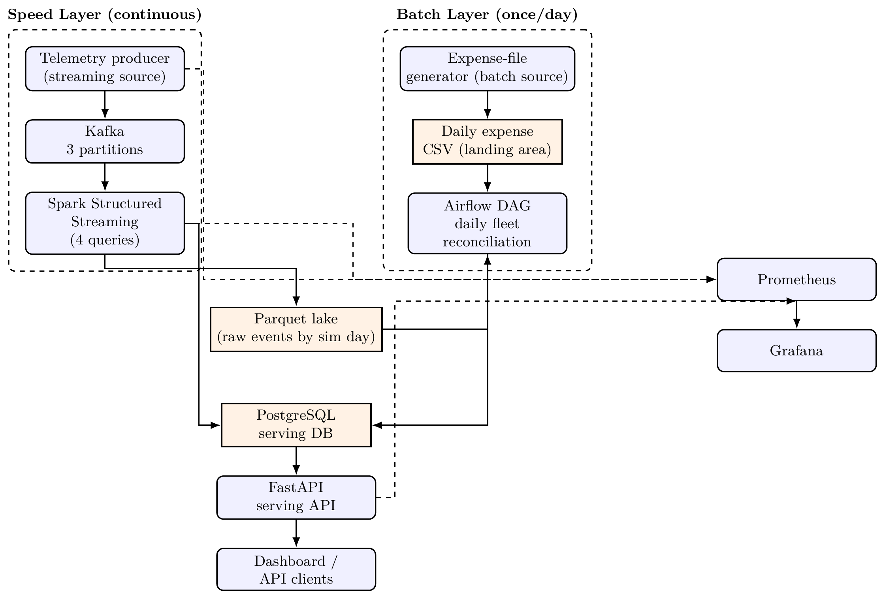

# Fleet Operations Pipeline

EC8203 Data Engineering Mini-Project -- **Use Case 1: Ride-Hailing Fleet Operations**.

A Lambda-architecture pipeline that gives a ride-hailing operator live fleet
utilization/earnings by zone, and a daily per-vehicle profitability
reconciliation once the previous day's fuel/maintenance costs land.

## Architecture



Continuous GPS/telemetry events flow through Kafka into a Spark Structured
Streaming speed layer, which writes windowed utilization/earnings metrics,
vehicle state, and alerts to Postgres, and archives raw events to a Parquet
lake. Independently, a once-daily expense file feeds an Airflow batch layer
that recomputes exact per-vehicle profitability from that same Parquet
lake and cross-checks it against the speed layer's totals. Both layers
converge on Postgres, served through a FastAPI service and dashboard, and
scraped by Prometheus/Grafana for observability. The full architecture
decision (Lambda vs. Kappa), technology-stack justification, and
observability design are covered in the project report.

## Running it

Requires Docker Desktop with **>= 6 GB** memory (Kafka + Spark + Airflow +
Postgres + Prometheus/Grafana all run locally).

### Quick start

```bash
cp .env.example .env      # first time only
docker compose up -d --build
docker compose ps         # wait until everything is healthy
```

### Bringing up services individually

Each service can also be started, stopped, or restarted on its own, which
is useful for demos (e.g. stopping the producer to trigger the
`NoDataReceived` alert) or for debugging one layer at a time:

```bash
docker compose up -d postgres kafka          # storage + broker first
docker compose up -d kafka-init              # creates the Kafka topics
docker compose up -d streaming stream-sim    # speed layer
docker compose up -d batch-sim airflow-init airflow-webserver airflow-scheduler  # batch layer
docker compose up -d api prometheus grafana  # serving + observability

docker compose stop stream-sim               # e.g. simulate a producer outage
docker compose logs -f streaming             # tail one service's logs
docker compose restart streaming             # restart just the streaming job
```

### Makefile shortcuts

A `Makefile` wraps the common Docker Compose commands:

```bash
make up        # creates .env from .env.example if missing, builds, starts everything
make logs      # tail all services
make topics    # show Kafka topic/partition layout
make psql      # psql shell on the serving DB
make test      # pure-python unit tests, no Docker required
make down      # stop, keep data
make reset     # stop + wipe volumes and generated data/reports
```

First `spark-submit` invocation downloads the `spark-sql-kafka` connector
jars via Maven, cached across restarts -- this needs internet access the
first time only.

One simulated day compresses to `SIM_DAY_SECONDS` real seconds (default
300s = 5 minutes), so a full daily ingest/reconcile cycle can be observed
within a single demo session. For a crisp "day 0" start right before a
demo, pin the epoch to now:

```bash
echo "SIM_EPOCH=$(date -u +%Y-%m-%dT%H:%M:%S)" >> .env
docker compose down && docker compose up -d
```

### URLs

| Service | URL | Notes |
|---|---|---|
| Fleet dashboard | http://localhost:8000/ | Live utilization + daily profitability, auto-refreshes every 5s |
| API docs | http://localhost:8000/docs | OpenAPI/Swagger |
| Airflow | http://localhost:8088 | admin/admin (from `.env`) |
| Prometheus | http://localhost:9090 | Targets: Status -> Targets |
| Grafana | http://localhost:3001 | admin/admin; Postgres + Prometheus datasources pre-provisioned |

### Trade-offs and what would change at production scale

- **Spark runs in `local[*]` mode**, not a real cluster. Correct choice at
  this data volume (one class-scale fleet), but at production scale you'd
  run on YARN/Kubernetes with autoscaling executors, and would need to
  revisit the driver-collects Postgres sink pattern used here (fine for a
  few hundred rows/micro-batch; would need a partitioned JDBC write or a
  proper sink connector at higher volume).
- **Batch reconciliation uses pandas, not Spark**, deliberately. At real
  fleet scale (thousands of vehicles, millions of trips/day) this would
  move to the same Spark cluster as the speed layer.
- **Idle-vehicle alerting is per-micro-batch stateful logic in Python**,
  not Spark's built-in state-store API. Simpler to reason about and test at
  this scale; would not scale past a single-partition bottleneck on
  vehicle-state writes.
- **No exactly-once guarantee end-to-end.** Postgres upserts make the sinks
  idempotent under replay/retry, but a crash between a Kafka commit and the
  Postgres write can still double-process a micro-batch's *effects*
  (harmless here since upserts overwrite, but would matter for e.g.
  billing).
- **Single-broker Kafka, single-node Postgres.** No replication; acceptable
  for a 2-week class project, not for production availability.
- **Vehicle roster and zone geography are synthetic**; a real deployment
  would source these from a fleet-management system.
- **Malformed-event injection is coarse** (~2% of events, three corruption
  modes). Good enough to exercise the DLQ path; not a substitute for a real
  schema-registry-enforced contract.

### How to reproduce the results

1. Bring up the stack (`make up` or `docker compose up -d --build`) and
   wait for `docker compose ps` to show everything healthy.
2. Open the dashboard at http://localhost:8000/ -- active/idle vehicles,
   earnings by zone, and pipeline health should populate within a few
   seconds.
3. Hit the live endpoints directly:
   ```bash
   curl -s localhost:8000/health | jq
   curl -s localhost:8000/metrics/fleet | jq
   curl -s localhost:8000/metrics/zones | jq
   curl -s localhost:8000/alerts | jq
   ```
4. Wait for at least one `SIM_DAY_SECONDS` interval (5 minutes by default)
   for the Airflow DAG's first run, then fetch the daily reconciliation
   report:
   ```bash
   curl -s "localhost:8000/reports/profitability?sim_day=0" | jq
   ```
   The same report is also written to `reports/daily_profitability_day_0.md`.
5. To reproduce the alerting behaviour shown in the report, stop the
   producer and watch Prometheus flag it:
   ```bash
   docker compose stop stream-sim
   ```
   Open http://localhost:9090/alerts -- `NoDataReceived` goes
   pending, then firing, within ~75 seconds. Restart with
   `docker compose start stream-sim` to see it self-heal.
6. Open Grafana (http://localhost:3001) to see the same metrics visualized
   on the pre-provisioned "Fleet" dashboard.

## Key API endpoints

- `GET /metrics/fleet`, `GET /metrics/zones` -- live utilization (business
  question: "what is fleet utilization and earnings by area/time-of-day
  right now?").
- `GET /reports/profitability?sim_day=N` -- daily reconciliation report,
  including the Lambda consistency check (business question: "which
  vehicles are becoming unprofitable once yesterday's costs are
  factored in?").
- `GET /alerts` -- active idle-vehicle alerts.
- `GET /health` -- pipeline health-check rule.
- `GET /metrics` -- Prometheus exposition.

The same daily report is also written to `reports/daily_profitability_day_N.md`
by the Airflow DAG (the "scheduled report file" deliverable, independent of
the live dashboard).

## Assumptions

- 1 simulated day = 300 real seconds by default (`SIM_DAY_SECONDS` in `.env`).
- The daily expense file for sim day *D* is expected once sim day *D+1*
  begins (i.e. "yesterday's" costs), matching the business question's
  "reconciling it daily against ... costs" framing.
- `zone` and `trip_completed` are additions to the fields suggested in the
  brief (explicitly permitted -- "you may adapt scope, e.g. add/change
  fields as required"): `zone` avoids needing reverse-geocoding downstream,
  and `trip_completed` marks exactly one event per finished trip carrying
  the settled fare, so the speed layer can sum earnings without
  double-counting a trip's in-progress events.
